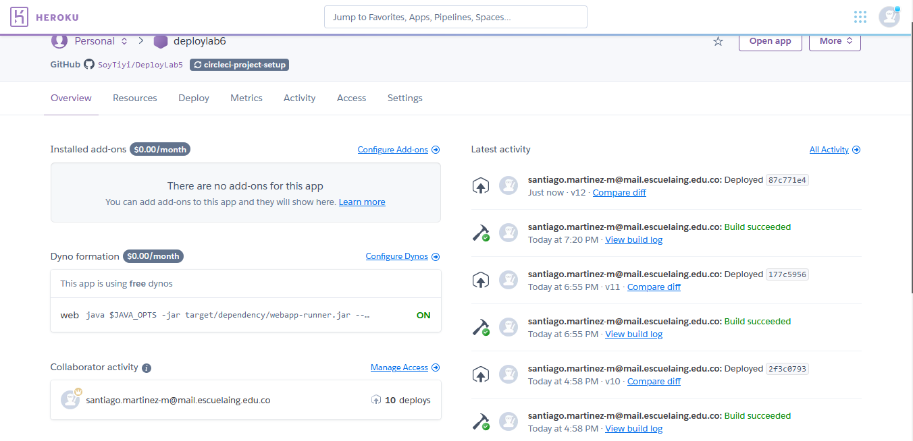

# DeployLab5

## Pruebas de aceptación 

1. Prueba de desviación con todos numeros iguales
    

2. Prueba de guardar intentos
    

3. Prueba de una lista con dos numeros que se repiten igual
    

4. Prueba de boton restart
    

5. Codacy review
    

6. Heroku
    

    [Heroku](https://dashboard.heroku.com/apps/deploylab6)

7. Circle ci
    